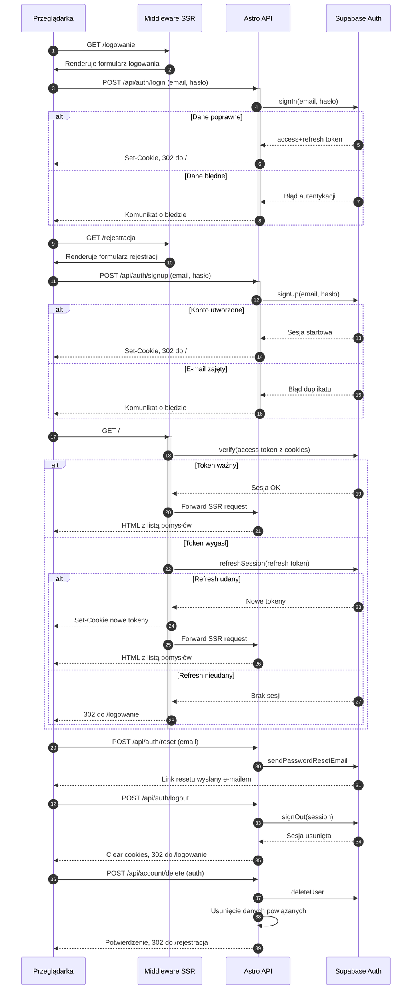

<authentication_analysis>

1. Przepływy: rejestracja z automatycznym logowaniem; logowanie; dostęp
   do stron chronionych z weryfikacją sesji; odświeżanie access tokenu z
   refresh tokenu; reset hasła przez link e‑mail; wylogowanie; hard delete
   kont, które usuwa dane i sesję; przekierowania na login dla gościa.
2. Aktorzy: Przeglądarka (użytkownik); Middleware Astro (SSR, strażnik
   tras, zarządzanie cookies/supabase clientem); Astro API (handlery auth,
   logika domenowa); Supabase Auth (rejestracja, logowanie, refresh,
   signout, reset, delete user).
3. Weryfikacja/odświeżanie: Middleware sprawdza access token z cookies;
   gdy wygasł próbuje refresh przez Supabase Auth, zapisuje nowe tokeny lub
   przekierowuje na login przy porażce; API ufa kontekstowi supabase w
   SSR; wylogowanie kasuje refresh/access.
4. Kroki: (a) formularz rejestracji/logowania wysyła POST do Astro API;
   API woła Supabase signUp/signIn; przy sukcesie ustawia ciasteczka i
   przekierowuje na listę pomysłów; (b) przy wejściu na trasę chronioną
   middleware waliduje sesję, ewentualnie refreshuje i wpuszcza do API lub
   odrzuca; (c) reset hasła inicjuje e-mail z linkiem; (d) wylogowanie i
   hard delete czyszczą sesję i wylogowują.
   </authentication_analysis>

<mermaid_diagram>

</mermaid_diagram>
