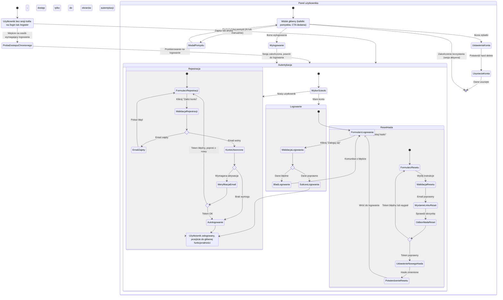

# Diagram podróży użytkownika (logowanie i rejestracja)

```mermaid
stateDiagram-v2
  [*] --> WejscieNiezalogowany
  WejscieNiezalogowany: Użytkownik bez sesji trafia na /login lub /register; dostęp tylko do ekranów autentykacji
  WejscieNiezalogowany --> Autentykacja
  WejscieNiezalogowany --> ProbaDostepuChronionego: Wejście na zasób wymagający logowania
  ProbaDostepuChronionego --> Autentykacja: Przekierowanie na logowanie

  state "Autentykacja" as Autentykacja {
    [*] --> WyborSciezki
    WyborSciezki --> Logowanie: Mam konto
    WyborSciezki --> Rejestracja: Nowy użytkownik

    state "Logowanie" as Logowanie {
      [*] --> FormularzLogowania
      FormularzLogowania --> WalidacjaLogowania: Kliknij "Zaloguj się"
      state if_login <<choice>>
      WalidacjaLogowania --> if_login
      if_login --> BladLogowania: Dane błędne
      BladLogowania --> FormularzLogowania: Komunikat o błędzie
      if_login --> SukcesLogowania: Dane poprawne
      SukcesLogowania --> PrzekierowaniePoLogowaniu
      FormularzLogowania --> ResetHasla: Link "Odzyskaj hasło"
    }

    state "Rejestracja" as Rejestracja {
      [*] --> FormularzRejestracji
      FormularzRejestracji --> WalidacjaRejestracji: Kliknij "Załóż konto"
      state if_email <<choice>>
      WalidacjaRejestracji --> if_email
      if_email --> EmailZajety: Email zajęty
      EmailZajety --> FormularzRejestracji: Pokaż błąd
      if_email --> KontoUtworzone: Email wolny
      state if_weryfikacja <<choice>>
      KontoUtworzone --> if_weryfikacja
      if_weryfikacja --> WeryfikacjaEmail: Wymagana aktywacja
      if_weryfikacja --> Autologowanie: Brak wymogu
      state if_token <<choice>>
      WeryfikacjaEmail --> if_token
      if_token --> Autologowanie: Token OK
      if_token --> FormularzRejestracji: Token błędny, poproś o nowy
      Autologowanie --> PrzekierowaniePoLogowaniu
    }

    state "ResetHasla" as ResetHasla {
      [*] --> FormularzResetu
      FormularzResetu --> WalidacjaResetu: Wyślij instrukcje
      WalidacjaResetu --> WyslanieLinkuReset: Email poprawny
      WyslanieLinkuReset --> OdbiorMailaReset: Sprawdź skrzynkę
      state if_token_reset <<choice>>
      OdbiorMailaReset --> if_token_reset
      if_token_reset --> UstawienieNowegoHasla: Token poprawny
      if_token_reset --> FormularzResetu: Token błędny lub wygasł
      UstawienieNowegoHasla --> PotwierdzenieResetu: Hasło zmienione
      PotwierdzenieResetu --> FormularzLogowania: Wróć do logowania
    }
  }

  PrzekierowaniePoLogowaniu: Użytkownik zalogowany, przejście do głównej funkcjonalności
  PrzekierowaniePoLogowaniu --> PanelPomyslow

  state "Panel użytkownika" as PanelPomyslow {
    [*] --> ListaPomyslow
    ListaPomyslow: Widok główny (kafelki pomysłów, CTA dodania)
    ListaPomyslow --> ModalPomyslu: Dodaj/edytuj pomysł (AI lub manualnie)
    ModalPomyslu --> ListaPomyslow: Zapisz lub anuluj
    ListaPomyslow --> UstawieniaKonta: Ikona zębatki
    ListaPomyslow --> Wylogowanie: Ikona wylogowania
    UstawieniaKonta --> UsuniecieKonta: Potwierdź hard delete
    UsuniecieKonta --> [*]: Dane usunięte
    Wylogowanie --> Autentykacja: Sesja zakończona, powrót do logowania
    ListaPomyslow --> [*]: Zakończenie korzystania (sesja aktywna)
  }
```
