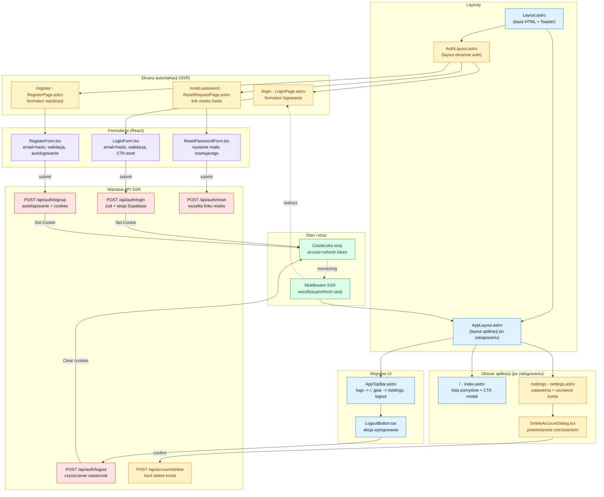

# Diagram architektury UI (logowanie i rejestracja)

<mermaid_diagram>

```mermaid
flowchart TD
  classDef updated fill:#fef3c7,stroke:#d97706,stroke-width:1px,color:#78350f;
  classDef shared fill:#e0f2fe,stroke:#0369a1,stroke-width:1px,color:#0f172a;
  classDef form fill:#ede9fe,stroke:#7c3aed,stroke-width:1px,color:#111827;
  classDef api fill:#fee2e2,stroke:#b91c1c,stroke-width:1px,color:#111827;
  classDef state fill:#dcfce7,stroke:#15803d,stroke-width:1px,color:#064e3b;

  subgraph Layouty
    BaseLayout["Layout.astro\n(baza HTML + Toaster)"]:::shared
    AuthLayout["AuthLayout.astro\n(layout ekranow auth)"]:::updated
    AppLayout["AppLayout.astro\n(layout aplikacji po zalogowaniu)"]:::shared
    BaseLayout --> AuthLayout
    BaseLayout --> AppLayout
  end

  subgraph "Ekrany autentykacji (SSR)"
    LoginPage["/login - LoginPage.astro\nformularz logowania"]:::updated
    RegisterPage["/register - RegisterPage.astro\nformularz rejestracji"]:::updated
    ResetPage["/reset-password - ResetRequestPage.astro\nlink resetu hasla"]:::updated
    AuthLayout --> LoginPage
    AuthLayout --> RegisterPage
    AuthLayout --> ResetPage
  end

  subgraph "Formularze (React)"
    LoginForm["LoginForm.tsx\nemail+haslo, walidacja, CTA reset"]:::form
    RegisterForm["RegisterForm.tsx\nemail+haslo, walidacja, autologowanie"]:::form
    ResetForm["ResetPasswordForm.tsx\nwyslanie maila resetujacego"]:::form
    LoginPage --> LoginForm
    RegisterPage --> RegisterForm
    ResetPage --> ResetForm
  end

  subgraph "Warstwa API SSR"
    LoginAPI["POST /api/auth/login\nzod + sesja Supabase"]:::api
    SignupAPI["POST /api/auth/signup\nautologowanie + cookies"]:::api
    ResetAPI["POST /api/auth/reset\nwysylka linku resetu"]:::api
    LogoutAPI["POST /api/auth/logout\nczyszczenie ciasteczek"]:::api
    DeleteAPI["POST /api/account/delete\nhard delete konta"]:::updated
  end

  subgraph "Stan i straz"
    SessionGuard["Middleware SSR\nweryfikacja/refresh sesji"]:::state
    SessionStore["Ciasteczka sesji\naccess+refresh token"]:::state
  end

  subgraph "Obszar aplikacji (po zalogowaniu)"
    HomePage["/ - index.astro\nlista pomyslow + CTA modal"]:::shared
    SettingsPage["/settings - settings.astro\nustawienia + usuniecie konta"]:::updated
    DeleteDialog["DeleteAccountDialog.tsx\npotwierdzenie ostrzezeniem"]:::updated
    AppLayout --> HomePage
    AppLayout --> SettingsPage
    SettingsPage --> DeleteDialog
  end

  subgraph "Wspolne UI"
    TopBar["AppTopBar.astro\nlogo -> /, gear -> /settings, logout"]:::shared
    LogoutButton["LogoutButton.tsx\nakcja wylogowania"]:::shared
    AppLayout --> TopBar
    TopBar --> LogoutButton
    LogoutButton --> LogoutAPI
  end

  LoginForm --"submit"--> LoginAPI
  RegisterForm --"submit"--> SignupAPI
  ResetForm --"submit"--> ResetAPI
  DeleteDialog --"confirm"--> DeleteAPI

  LoginAPI --"Set-Cookie"--> SessionStore
  SignupAPI --"Set-Cookie"--> SessionStore
  LogoutAPI --"Clear cookies"--> SessionStore
  SessionStore -.monitoring.-> SessionGuard
  SessionGuard --> AppLayout
  SessionGuard -.redirect.-> LoginPage
```

</mermaid_diagram>
